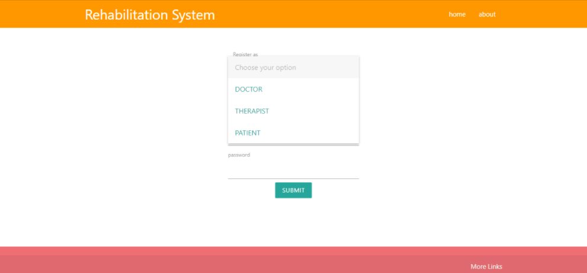

#  Rehabilitation System
AIM: The main aim of our application is to maintain the patient report and rehabilitation information for ease of access for the doctor and therapist to serve the best treatment for the certain injuries of the patient.

PROBLEM STATEMENT: In traditional way of rehabilitation the doctor and therapist maintains the patient report manually, and there is no intrapersonal communication between the doctor and therapist. In some case patient needs to change his therapist, then it is very difficult to know about his past treatment. Hence this application can store the data for long time and retrieve it whenever needed.

1.login.php : It contains home page and login window. three login window is embedded in single page using collapsible feature of materialize css.
![]Images/LoginpageSnap.png)

2.register.php : It is the signUp Page

